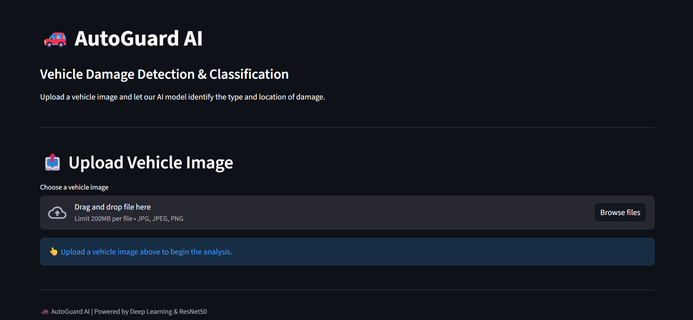

# 🚗 Vehicle Damage Prediction

A deep learning-based application for detecting and classifying vehicle damage from images using **ResNet50**, **PyTorch**, **Streamlit**, and **FastAPI**.

---

## 📸 Application Preview

<p align="center">
  
</p>

<p align="center">
  <b>AI-powered vehicle damage classification system</b>
</p>

---

## 🧠 About the Project

Vehicle damage assessment is an important part of vehicle inspection and insurance processing.

This project uses a deep learning model to automatically classify vehicle images into different damage conditions.

The model can identify:

| Class | Description |
|---|---|
| 🚨 Front Breakage | Breakage detected at the front |
| 💥 Front Crushed | Front portion is crushed |
| ✅ Front Normal | Front portion appears normal |
| 🚨 Rear Breakage | Breakage detected at the rear |
| 💥 Rear Crushed | Rear portion is crushed |
| ✅ Rear Normal | Rear portion appears normal |

---

## 🎯 Features

- 📷 Upload vehicle images
- 🤖 AI-based damage classification
- 🧠 ResNet50 deep learning model
- 📊 Prediction confidence
- 📈 Class probability analysis
- 🌐 Streamlit web interface
- ⚡ FastAPI backend
- 🔍 Six-class vehicle damage classification

---

## 🏗️ Project Architecture

```text
                    🚗 Vehicle Image
                           │
                           ▼
                  ┌─────────────────┐
                  │   Streamlit UI  │
                  └────────┬────────┘
                           │
                           ▼
                  ┌─────────────────┐
                  │    FastAPI      │
                  │     Backend     │
                  └────────┬────────┘
                           │
                           ▼
                  ┌─────────────────┐
                  │    ResNet50     │
                  │  Deep Learning  │
                  └────────┬────────┘
                           │
                           ▼
                ┌─────────────────────┐
                │ Damage Classification│
                └──────────┬──────────┘
                           │
                           ▼
              🚨 Front Breakage / etc.
